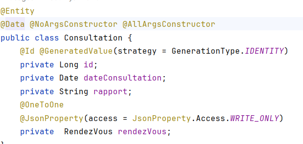
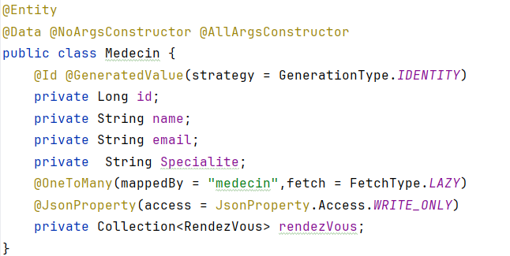
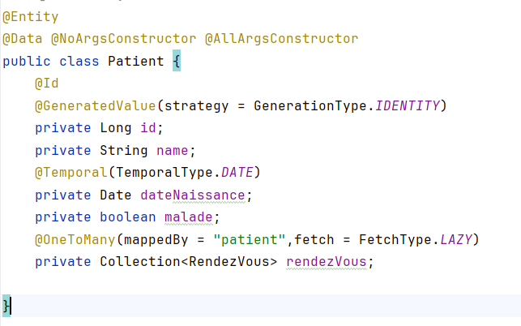
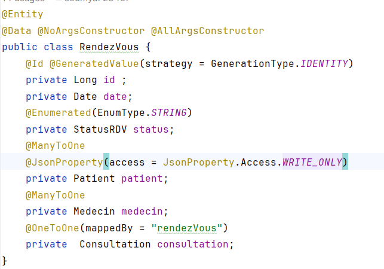
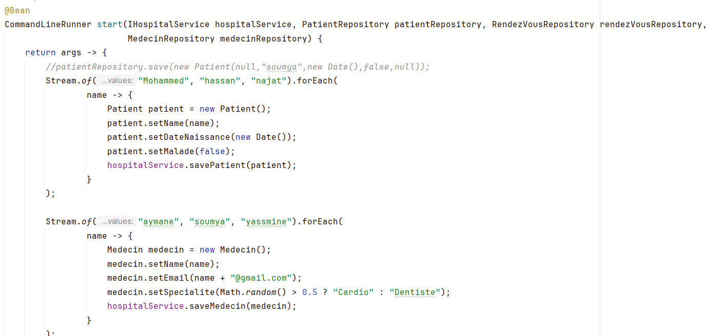
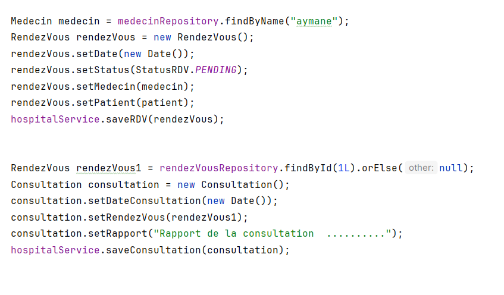

<h1>Compte Rendu </h1>
<h2>A propos</h2>
<body>
<h> L'objectif de ce tp est de créer une application de gestion medical en gérant les patients,les medecins,les rendez-vous et les consultations et En stockant les données sur MySQL.

</h>
</body>

<h2> Entities </h2>
-Consultation 

-Medecin

-Patient 

-RendezVous

    - Ajout
 - Patient et Medecin

- RendezVouz et Consultation 

    
